# Usage
First make sure to follow the instructions to install the dependencies and tools as described in the [INSTALL.md](INSTALL.md) file.

Once installed run the project with 
```sh
uv run cli/tui/tui.py
```

Or alternatively, if [just](https://github.com/casey/just) is installed, you can run the project with
```sh
just tui
``` 


This will start the terminal user interface. 
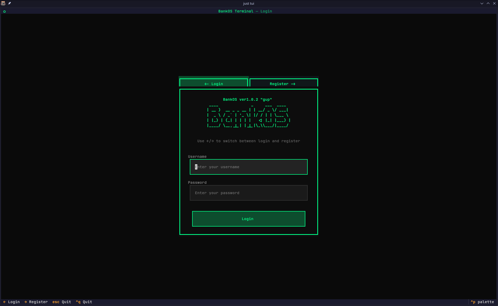

From there you can log in with your username and password if you have an account. 
Just type in your credientials and hit log in.

If you don't have an account, you can hit the right arrow key (or click on the register button) to go to the registration tab.
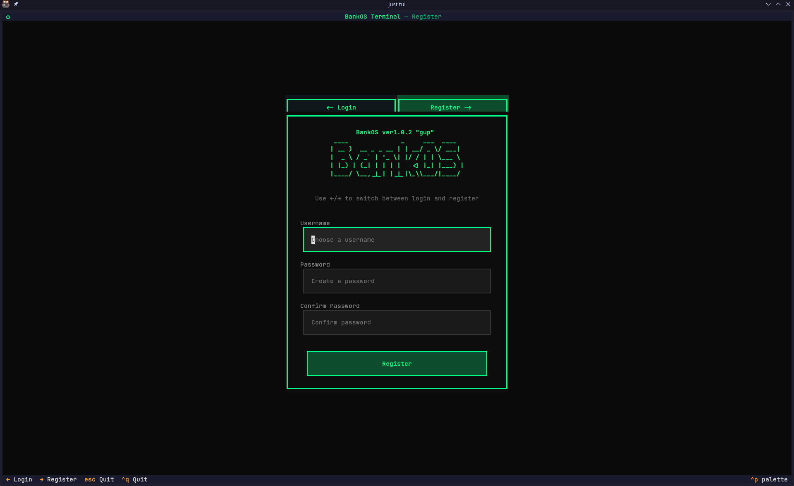
Now enter your desired username and password and confirm your password and hit register.
This will create your account and log you in.

## Customer Dashboard
If you logged in as a customer account, you will be met with the customer dashboard. 
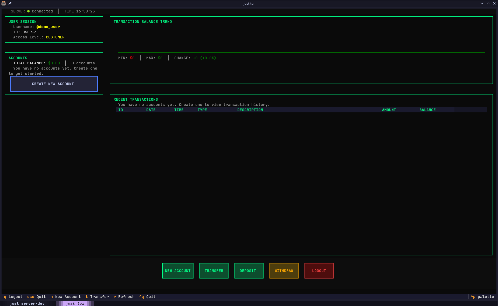

Now you can create a new bank account by hitting the "CREATE NEW ACCOUNT" button in the top left. 

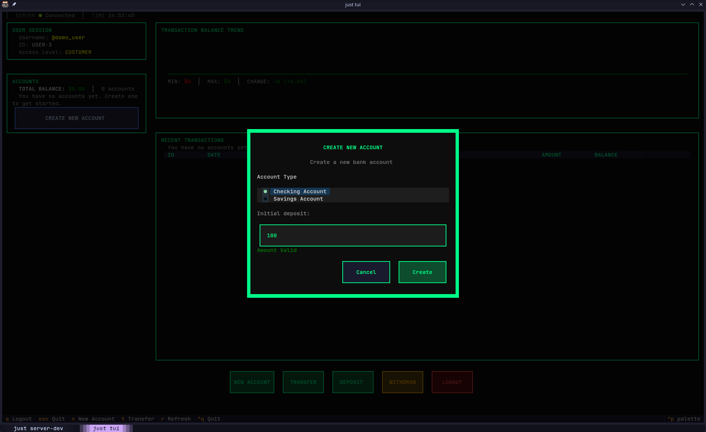
Select the type of account you want to create and enter an initial deposit amount and hit "CREATE ACCOUNT".
This will create the new bank account and add it to your dashboard.

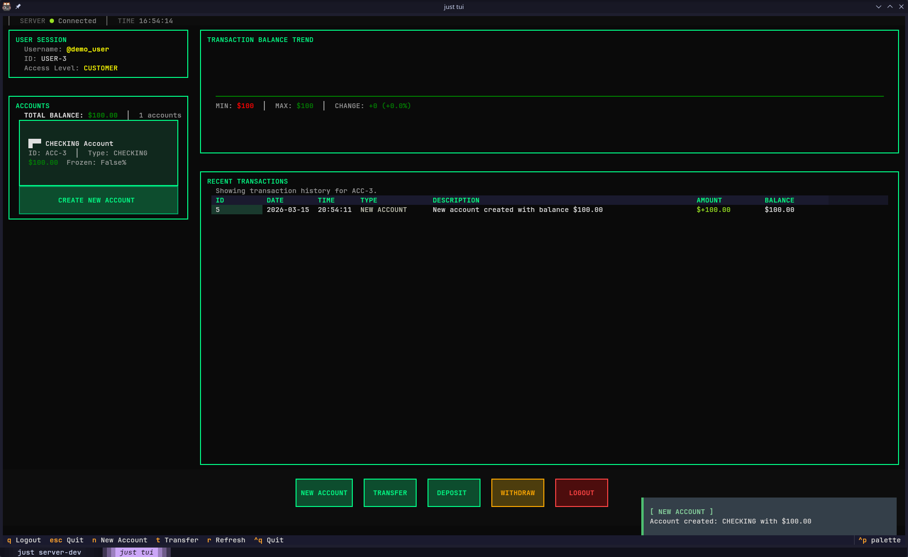

You can now hit the deposit or withdraw buttons and use the drop down to select the account to make transactions on the account. 
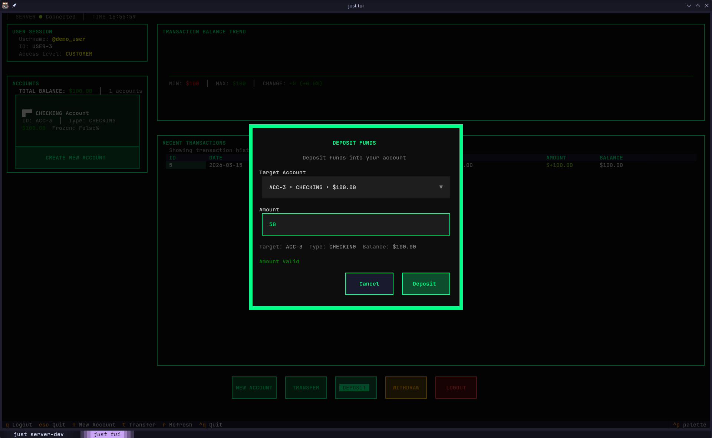
The transaction is then logged in the transaction history and the balance is updated.
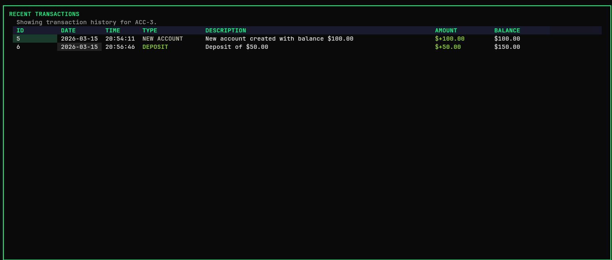
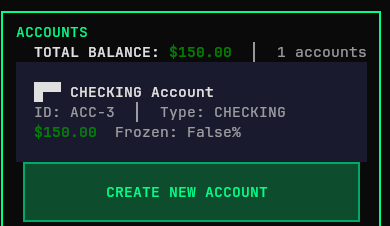

Withdraws work the same way and are logged accordingly. 

Transfers also work the same way. Hit transfer and select the drop down from your accounts, and the drop down to other accounts, enter a value and hit transfer.
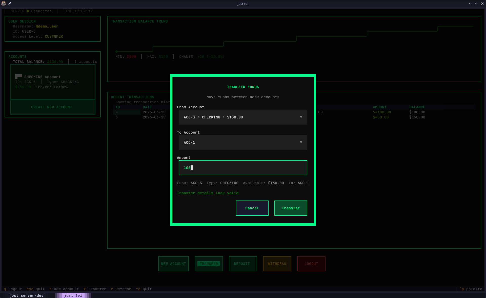
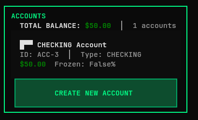

Now if I go to the customer that owns account 1, and check the balance of account 1, we can see that the transfer was successful and the balance was updated accordingly.
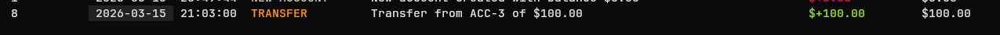

You can now log out by hitting the log out button in the buttom right, this will take you back to the login page.
You can hit ESC or CTRL+C to exit, terminating the program.

## Staff Dashboard (Admin) 
If you instead log in as a staff account, you will be met with the staff dashboard. This is available to both teller and admin accounts, but some functionality is only available to admin accounts.
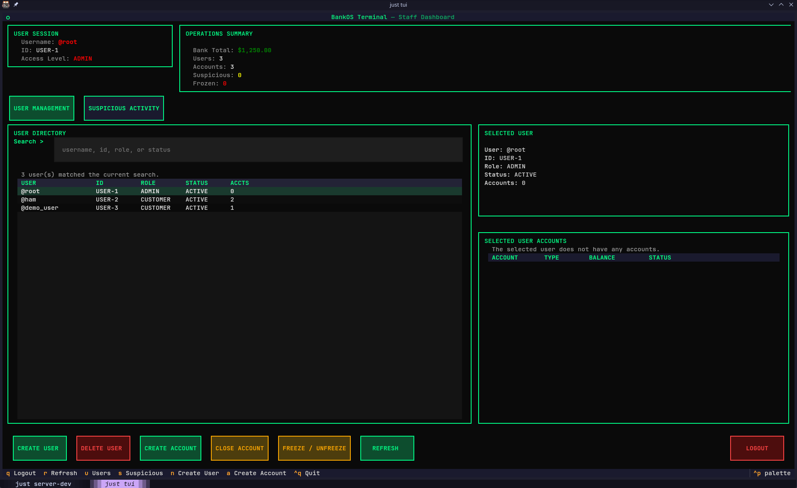
The default credentials for the root account are username: ```root``` and password: ```root```. This account has full administrative privileges and is automatically created when the database is initialized. 

You can now select any user in the database to view their accounts where you can perform staff actions such as freezing or unfreezing and closing accounts. You can also view the total balance of the bank in the top right, but only if you have admin privileges.
Simply click on the account to select it and hit the respective button on the bottom to perform the action.
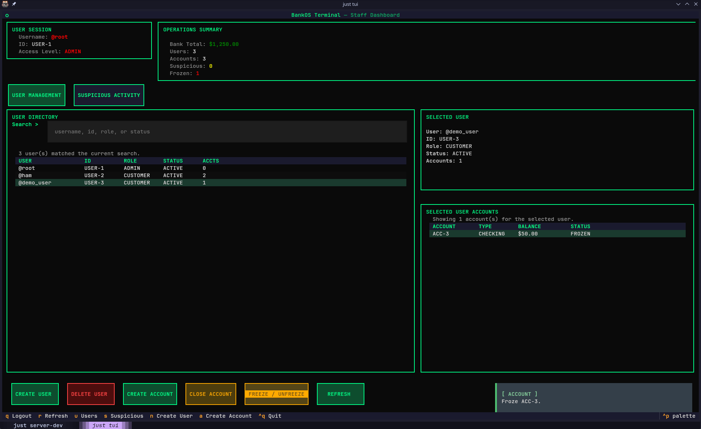
You can also view suspicious activity, by hitting the "SUSPICIOUS ACTIVITY" tab. 
Suspicious activity is determined by any account that has withdrawn more than ```$10,000``` at once. 
If we unfreeze the demo account and make a withdraw of ```$10,000```, we can see that the account is flagged for suspicious activity and shows up in the suspicious activity tab.
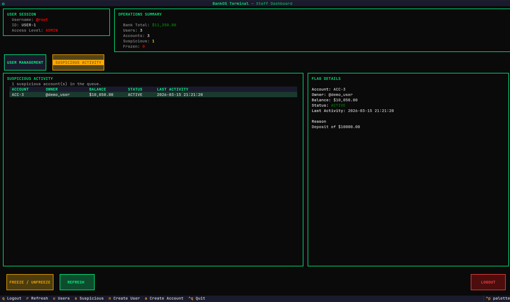
We can then freeze the account, which will stop deposits and withdraws from being made on the account until it is unfrozen.

Now going back to that acount and trying to deposit, withdraw or transfer, will give this error message, since the account is frozen.
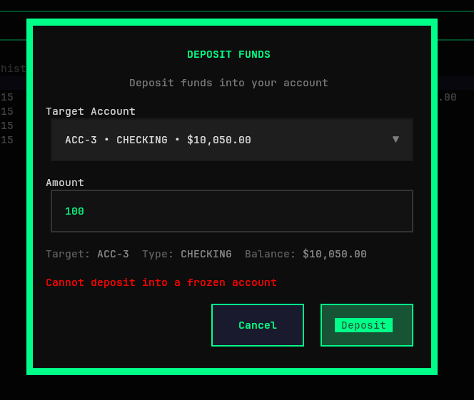

From the staff dashboard, you can also create new user accounts by hitting the "CREATE USER" button in the bottom left.
We will create a teller account with username: ```teller``` and password: ```teller```, choosing the teller permission level.
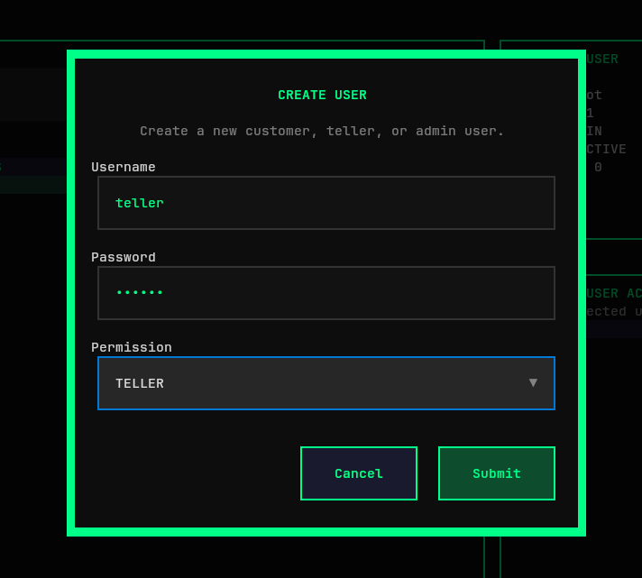
Now we can log out and log back in with the teller account and see that we have access to the staff dashboard.
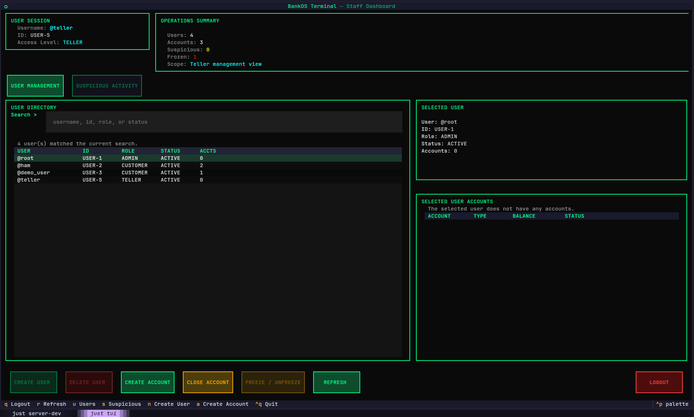
The teller view cannot delete users or freeze accounts, but they can still create bank accounts for users by selecting the user and hitting the create acccount button. They can also close the bank accounts. 
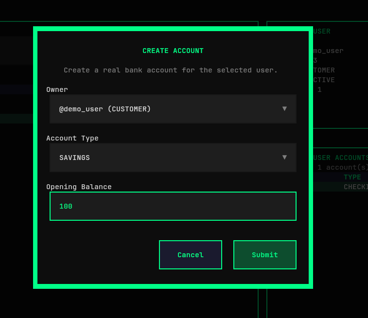

Now the account shows up for the user, and they can use it as normal.
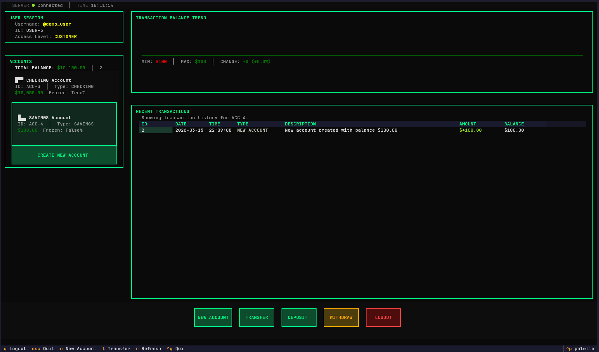
